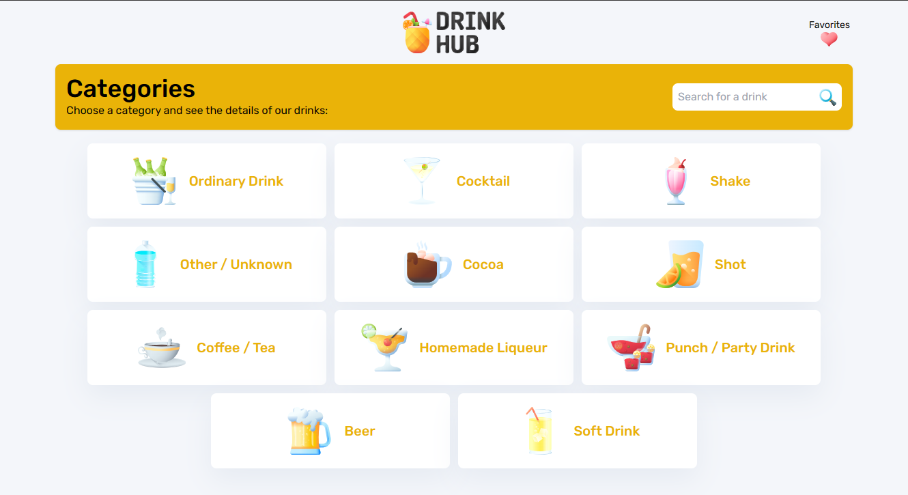

# DrinkHub

Bem-vindo ao DrinkHub! 
Este projeto front-end permite que os usuários descubram ingredientes e métodos de preparo para diversas bebidas, todas obtidas da API do The Cocktail DB. Para garantir consistência, todo o projeto é desenvolvido em inglês.

<p align="center">
  
</p>

## 🚀 Desenvolvimento e Recursos

A aplicação é desenvolvida usando **Nuxt** com **TypeScript**, e o **TailwindCSS** é escolhido para a estilização, simplificando o processo de design. As principais funcionalidades da aplicação incluem:

- **Explorar Bebidas por Categorias:** Descubra bebidas com base em diferentes categorias.
- **Informações Detalhadas da Bebida:** Obtenha informações detalhadas para cada bebida, incluindo ingredientes e métodos de preparo.
- **Salvar Bebidas como Favoritas:** Utilize o LocalStorage para salvar bebidas como favoritas para acesso rápido.
- **Pesquisar por Nome da Bebida:** Procure facilmente por bebidas pelo nome.

Além dessas funcionalidades, a aplicação trata possíveis erros da API de maneira elegante, gerencia rotas inexistentes e garante um design responsivo para uma experiência de usuário perfeita.

## 💻 Instalação

Para começar, certifique-se de ter o Node e o NPM instalados para baixar as dependências necessárias. Siga estes passos:

```bash
# Instalar dependências
$ npm install

# Servir com recarga rápida em localhost:3000
$ npm run dev

# Compilar para produção e iniciar o servidor
$ npm run build
$ npm run start

# Gerar um projeto estático
$ npm run generate
```

Sinta-se à vontade para explorar, contribuir e aprimorar a experiência do DrinkHub!

## 🛠️ Contribuição

Se você deseja contribuir para o DrinkHub, siga estas etapas:

1. Faça um fork do repositório.
2. Crie um novo branch para sua funcionalidade ou correção de bug.
3. Faça suas alterações e as comite com mensagens claras e concisas.
4. Faça push das suas alterações para o seu fork.
5. Abra um pull request, detalhando as alterações que você fez.

Brinde à descoberta e aproveite suas bebidas favoritas com o DrinkHub! 🍹🥂

## :memo: Licença

Esse projeto está sob a licença MIT.

---

Feito com ♥ by [Lucas Silva](https://github.com/lucasdasilva182) :wave:
